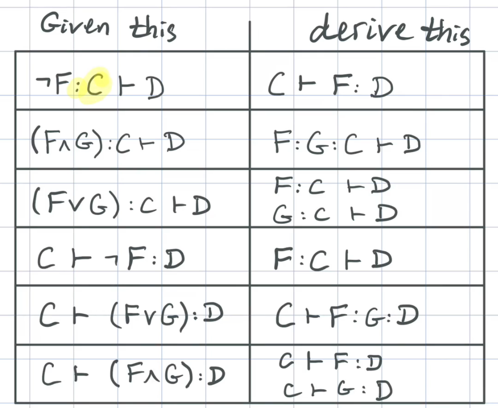

# Logic to Implement
<center>

</center>

# Task 1

All but one of the cases for the function wang have been implemented already. However, if you scroll down to the bottom of Main.hs, you will see that the last case, where left and right are empty, always returns True. This 'base case' of the algorithm should instead return True if and only if the fully-reduced sequent is valid. As we have discussed, this amounts to checking whether there is some propositional letter occuring in both reducedLeft and reducedRight.

For example:
```
Main> wang [] [] ['A', 'B'] ['C', 'D']
False

Main> wang [] [] ['A', 'B'] ['A', 'C']
True
```
Your first task is to correctly implement this base case.

# Explainer 2

With the completion of the base case, our implementation of Wang's algorithm is in a functioning state, and can be used to verify the validity of propositional formulas. For example:
```
Main> valid (parse "(B | (~B))")
True

Main> valid (parse "((P | Q) & (~P))")
False
```
However, you may have noticed that the algorithm lacks the ability to handle some logical connectives, namely implication (→), biimplication (↔) and exclusive or (⊕).

We can extend this algorithm's power and usefulness by adding cases to handle these additional connectives. All we have to do is figure out the rewriting rules to use.

Let's consider the case of implication.

In the video, we reasoned that if an implication $P→Q$ is found on the right side of the sequent, then we could rewrite the sequent with the formula $P$ on the left side and $Q$ on the right side. This is because $ P→Q≡¬P∨Q $, and disjunctions can be rewritten away on the left hand side, and the negation on $P$ requires moving it to the other side of the sequent. In summary:
$$ C⊢P→Q:D⟹P:C⊢Q:D $$

What if an implication $P→Q$ shows up on the left side of the sequent? Well, we can apply similar reasoning: $P→Q$ is just $¬P∨Q$. A disjunction on the left splits the sequent in two. In one of the resulting sequents, a negation will cause that formula to change sides. In summary:
$$ P→Q:C⊢D⟹{C⊢P:DQ:C⊢D} $$

These two cases have been added for you to the implementation of Wang's algorithm in the editor.

# Task 2


With the derivation and implementation of one additional logical connective under our belt, it's your turn to try. This problem asks you to extend our implementation of Wang's algorithm to handle formulas involving the biimplication connective (↔). You'll want to start by copying over your solution to the previous exercise.

Extend the implementation of Wang's algorithm to allow formulas with biimplication connectives (↔). Start by deriving some rewriting rules for when this connective appears on the left or right side of the sequent, then add the required recursive cases to the algorithm. After you are finished, the valid function should be able to deal with formulas involving biimplications.

For example:
```
Main> valid (parse "((P -> Q) <-> (Q -> P))")
False

Main> valid (parse "((P -> Q) <-> ((~Q) -> (~P)))")
True
```
## Challenge: 
```no :)``` 

If you're up for an additional challenge, try to derive rewriting rules for the exclusive or connective and add these to the algorithm. This will extend your implementation of Wang's algorithm so that it is capable of handling any of the propositional formulas we will encounter in this subject.

